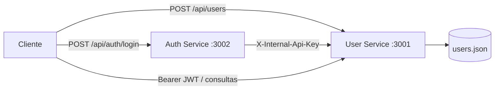

# Sistema de usuários com microsserviços

API em Node.js composta por dois processos independentes:

- **User Service** (`porta 3001`): criação, consulta e armazenamento de usuários;
- **Auth Service** (`porta 3002`): valida as credenciais com o User Service e emite um JWT.

As senhas são armazenadas somente como hash BCrypt. A comunicação interna é protegida por uma chave de serviço, as consultas públicas exigem JWT e o CORS aceita apenas as origens configuradas.

## Arquitetura



## Como executar

Requisito: Node.js 20 ou superior.

```powershell
npm.cmd install
npm.cmd start
```

Os dois serviços iniciam juntos. Para iniciar separadamente:

```powershell
npm.cmd run start:users
npm.cmd run start:auth
```

Também é possível executar com `docker compose up --build`. Antes de publicar o sistema, copie `.env.example` para `.env` e substitua `JWT_SECRET` e `INTERNAL_API_KEY` por valores longos e aleatórios.

## Documentação e endpoints

Cada microsserviço expõe sua própria documentação Swagger interativa:

- User Service: <http://localhost:3001/docs>
- Auth Service: <http://localhost:3002/docs>
- OpenAPI em JSON: <http://localhost:3001/api-docs.json> e <http://localhost:3002/api-docs.json>

| Método | Endpoint | Autenticação | Finalidade |
|---|---|---|---|
| `POST` | `http://localhost:3001/api/users` | Pública | Criar usuário |
| `GET` | `http://localhost:3001/api/users` | Bearer JWT | Listar usuários |
| `GET` | `http://localhost:3001/api/users/{id}` | Bearer JWT | Consultar usuário pelo ID |
| `POST` | `http://localhost:3002/api/auth/login` | Pública | Efetuar login e obter JWT |
| `GET` | `http://localhost:3001/internal/users/by-email/{email}` | `X-Internal-Api-Key` | Comunicação Auth → Users |
| `GET` | `/health` | Pública | Saúde de cada serviço |

## Exemplo do fluxo completo

1. Crie o usuário:

```powershell
$usuario = Invoke-RestMethod -Method Post -Uri http://localhost:3001/api/users `
  -ContentType 'application/json' `
  -Body '{"name":"Maria Silva","email":"maria@email.com","password":"Senha@123"}'
```

2. Faça o login:

```powershell
$login = Invoke-RestMethod -Method Post -Uri http://localhost:3002/api/auth/login `
  -ContentType 'application/json' `
  -Body '{"email":"maria@email.com","password":"Senha@123"}'
```

3. Consulte os usuários com o token recebido:

```powershell
Invoke-RestMethod -Uri http://localhost:3001/api/users `
  -Headers @{ Authorization = "Bearer $($login.accessToken)" }
```

## Configuração

| Variável | Padrão | Descrição |
|---|---|---|
| `JWT_SECRET` | valor apenas para desenvolvimento | Segredo compartilhado para assinar/verificar JWT |
| `INTERNAL_API_KEY` | valor apenas para desenvolvimento | Protege a comunicação interna |
| `USER_SERVICE_PORT` | `3001` | Porta do User Service |
| `AUTH_SERVICE_PORT` | `3002` | Porta do Auth Service |
| `USER_SERVICE_URL` | `http://localhost:3001` | URL interna usada pelo Auth Service |
| `CORS_ORIGINS` | localhost nas portas 3000 e 5173 | Origens permitidas, separadas por vírgula |
| `JWT_EXPIRES_IN` | `1h` | Validade do token |
| `USERS_FILE` | `services/user-service/data/users.json` | Arquivo de persistência |

Para rodar os testes automatizados:

```powershell
npm.cmd test
```

